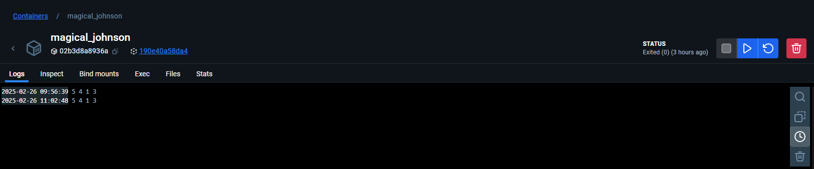
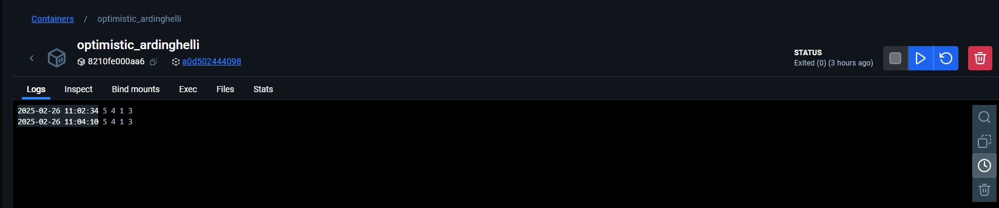
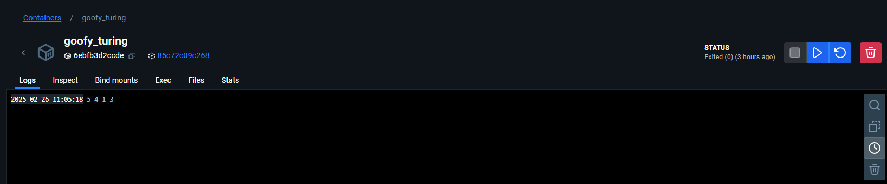

Results for the Software Interview Problems
===

# Problem - 1

- C++ Docker Image

```
# Get the GCC preinstalled image from Docker Hub
FROM gcc

# Copy the current folder which contains C++ source code to the Docker image under /usr/src
COPY src /usr/src/
COPY Makefile /usr/src/

# Specify the working directory
WORKDIR /usr/src/

# Use GCC to compile the Test.cpp source file
RUN make

# Run the program output from the previous step
CMD ["./target/lru_cpp"]
```

-  Python Docker Image

```
# Get the python3 preinstalled image from Docker Hub
FROM python:3

# Copy the source code to the destination
COPY src /usr/src/

# Specify the working directory
WORKDIR /usr/src/

# Run the program output from the previous step
CMD ["python","__init__.py"]
```

- Java Docker Image

```
# Get the GCC preinstalled image from Docker Hub
FROM maven

# Copy the current folder which contains C++ source code to the Docker image under /usr/src
COPY src /usr/src/src/
COPY pom.xml /usr/src/

# Specify the working directory
WORKDIR /usr/src/

# Use maven to package the jar assuming the tests passed
RUN mvn package

# Run the program output from the previous step
CMD ["java",  "-jar", "target/lru-java-0.0.1.jar"]
```

# Problem - 2

- C++ Build

```
Makefile

TARGET=$(CURDIR)/target
$(info $(TARGET))
dummy:=$(shell mkdir -p $(TARGET))

.DEFAULT: all

.PHONY: all clean

all: src/test.cpp

src/test.cpp:
	$(CXX) $(CXXFLAGS) -o $(TARGET)/lru_cpp /usr/src/test.cpp

clean:
	-rm -rf target
```

- Java Build

```
pom.xml

<?xml version="1.0"?>
<project xsi:schemaLocation="http://maven.apache.org/POM/4.0.0 http://maven.apache.org/xsd/maven-4.0.0.xsd" xmlns="http://maven.apache.org/POM/4.0.0"
         xmlns:xsi="http://www.w3.org/2001/XMLSchema-instance">
    <modelVersion>4.0.0</modelVersion>

    <artifactId>lru-java</artifactId>
    <groupId>com.pedro</groupId>
    <version>0.0.1</version>
    <name>LRU JAVA</name>
	<packaging>jar</packaging>

    <properties>
        <maven.compile.version>3.8.0</maven.compile.version>
        <maven.surefire.version>2.22.0</maven.surefire.version>
        <maven.jar.verison>3.1.2</maven.jar.verison>
        <junit-platform.version>5.5.0-RC2</junit-platform.version>
        <project.build.sourceEncoding>UTF-8</project.build.sourceEncoding>
    </properties>

    <build>
        <plugins>
            <plugin>
                <groupId>org.apache.maven.plugins</groupId>
                <artifactId>maven-surefire-plugin</artifactId>
                <version>${maven.surefire.version}</version>
            </plugin>
            <plugin>
                <groupId>org.apache.maven.plugins</groupId>
                <artifactId>maven-compiler-plugin</artifactId>
                <version>${maven.compile.version}</version>
                <configuration>
                    <source>1.8</source>
                    <target>1.8</target>
                </configuration>
            </plugin>
            <plugin>
                <groupId>org.apache.maven.plugins</groupId>
                <artifactId>maven-jar-plugin</artifactId>
                <version>${maven.jar.verison}</version>
				<configuration>
					<archive>
                        <manifest>
						    <addClasspath>true</addClasspath>
                            <mainClass>LRUCache</mainClass>
					    </manifest>
                    </archive>
				</configuration>
            </plugin>
        </plugins>
    </build>

    <dependencies>
        <dependency>
            <groupId>org.junit.jupiter</groupId>
            <artifactId>junit-jupiter-api</artifactId>
            <version>${junit-platform.version}</version>
            <scope>test</scope>
        </dependency>
        <dependency>
            <groupId>org.junit.jupiter</groupId>
            <artifactId>junit-jupiter-engine</artifactId>
            <version>${junit-platform.version}</version>
            <scope>test</scope>
        </dependency>
    </dependencies>
</project>

LRUCache.java

import java.util.Deque;
import java.util.LinkedList;
import java.util.HashSet;

public class LRUCache {

    // store keys of cache
    static Deque<Integer> dq;

    // store references of key in cache
    private static HashSet<Integer> map;

    // maximum capacity of cache
    static int csize;

    LRUCache(int n) {
        dq = new LinkedList<>();
        map = new HashSet<>();
        csize = n;
    }

    void refer(int x) {
        // not present in cache
        if (!map.contains(x)) {
            // cache is full
            if (dq.size() == csize) {
                // delete least recently used element
                int last = dq.removeLast();
                map.remove(last);
            }
        } else { // present in cache
            dq.remove(x);
        }

        // update reference
        dq.push(x);
        map.add(x);
    }

    // display contents of cache
    private void display() {
        for (Integer integer : dq) {
            System.out.print(integer + " ");
        }
        System.out.println("");
    }

    public static void main(String[] args) {
        LRUCache ca = new LRUCache(4);
        ca.refer(1);
        ca.refer(2);
        ca.refer(3);
        ca.refer(1);
        ca.refer(4);
        ca.refer(5);
        ca.display();
    }

}


LRUCacheTest.java

import org.junit.jupiter.api.DisplayName;
import org.junit.jupiter.api.Test;

import static org.junit.jupiter.api.Assertions.assertEquals;

public class LRUCacheTest {

    @Test
    @DisplayName("Initialization test successful")
    void initLRUCache() {
        LRUCache c = new LRUCache(5);

        assertEquals(c.csize, 5);
    }

    @Test
    @DisplayName("Test LRU last insert is head")
    void testLRULastInsertIsHead() {
        LRUCache c = new LRUCache(4);
        c.refer(4);
        c.refer(2);

        assertEquals(2, c.dq.peek());
    }

}
```

- Python Run

```
lru.py

class LRUCache:
    def __init__(self, capacity):
        self.capacity = capacity
        self.cache = []
        self.lru = {}

    def refer(self, key):
        # not present in cache
        if key not in self.lru:
            # cache is full
            if len(self.cache) == self.capacity:
                last = self.cache.pop()
                del self.lru[last]
        # present in cache
        else:
            self.cache.remove(key)
        
        # update reference
        self.cache.insert(0, key)
        self.lru[key] = key

    def display(self):
        for i in self.cache:
            print(i,end=' ')
        print('')

```

# Problem - 3

- C++ Docker Run Output

```

```

- Java Docker Run Output

```

```

- Python Docker Run Output

```

```
